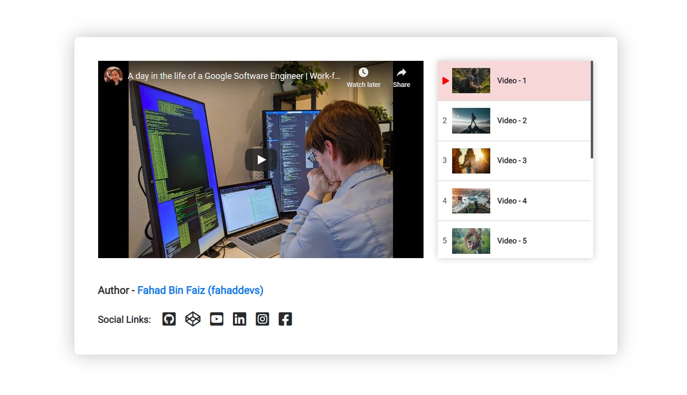

# youtube-video-list-player (jQuery version)

:point_right: Version 1.2.1

**You are looking for Youtube video playlist?**
This simple repo will help you.
Just download the repo and copy paste some lines of code.

Just few lines of jQueruy 
```javascript
  $( ".list-btn" ).each(function() {
    $(this).on('click', function(){
      var dataSrc = $(this).attr("data-src");
      $('#video-wrapper').attr('src', dataSrc);

      // add active class with "list-btn"
      var element = $(this).parent("li");
      if (element.hasClass("active")) {
        element.find("li").removeClass("active");
      }
      else {
        element.addClass("active");
        element.siblings("li").removeClass("active");
        element.siblings("li").find("li").removeClass("active");
      }

    });
  });
```

### Result 


Here is the [Demo link:](https://fahaddevs.github.io/youtube-video-list-player/)


---


##### If you're interested this project, Please contribute and hit the star button.

| Social Medias | Links                                                      |
| ------------- | ---------------------------------------------------------- |
| Facebook      | [Facebook Profile](https://www.facebook.com/fahaddevs)     |
| Linkedin      | [Linkedin Profile](https://www.linkedin.com/in/fahaddevs/) |
| Twitter       | [Twitter Profile](https://twitter.com/fahaddevs)           |
| Instagram     | [Instagram Profile](https://www.instagram.com/fahaddevs/)  |
| CodePen       | [CodePen Profile](https://codepen.io/fahaddevs/)           |